# Egipt OpenGL Game

### 1.0 Interchangable day and night

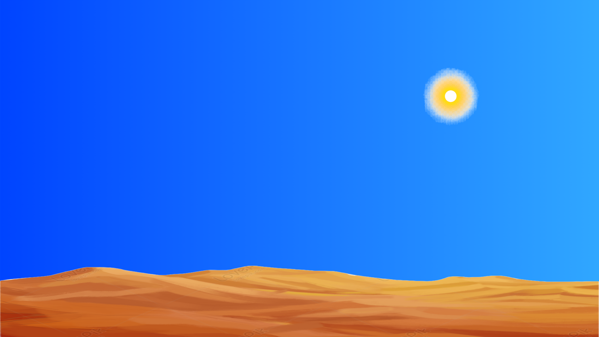
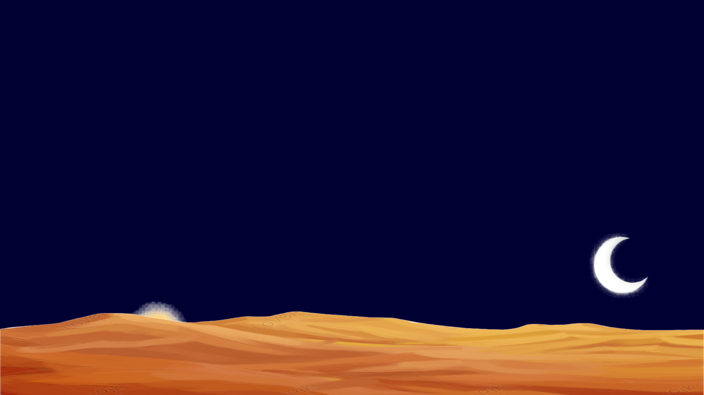

### 1.1 Stars appearing at night 

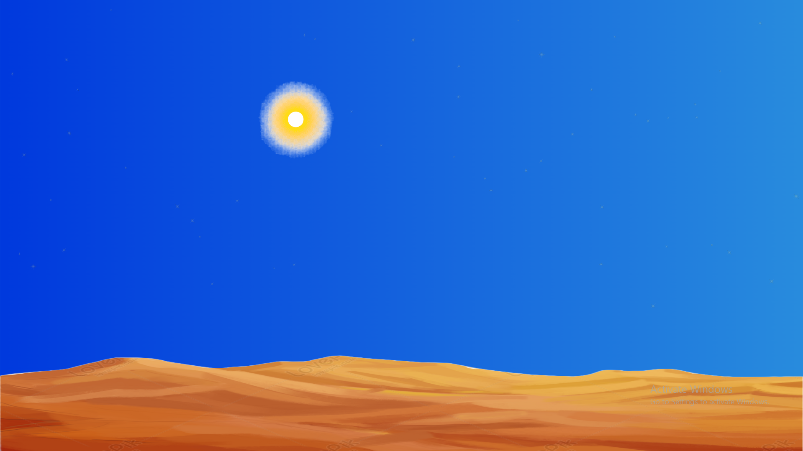

### 1.2 Fish swiminng in Water

* Fish swims in direction in which it is flipped.
* When it reaches edge of the lake it flips and continues to swim.

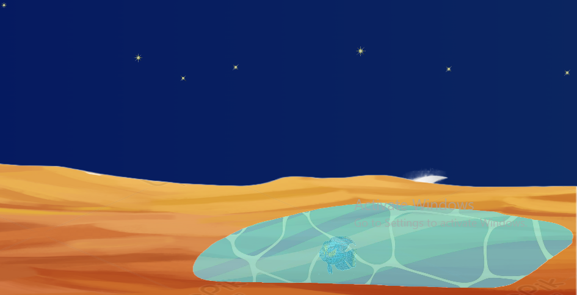
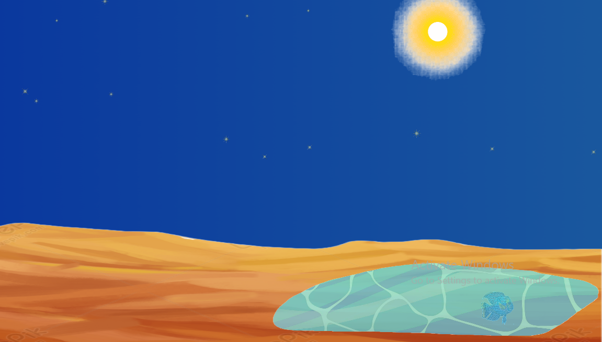

### 1.3 Interchangable grass

* Grass visibility can be toggled on keys '1' and '2'
* New grass preset can be genereted on key 'G'

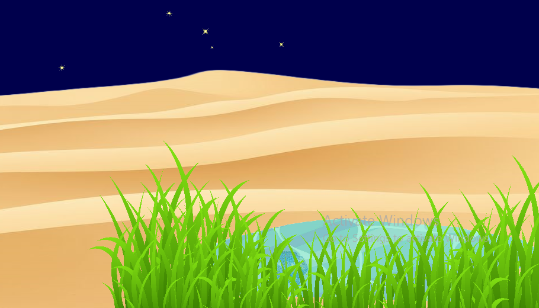
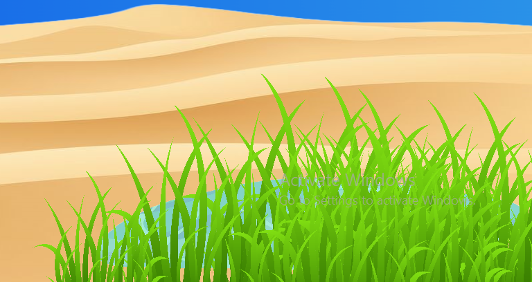

### 1.4 Pyramids generation

* On key '3' generate new pyramid preset.

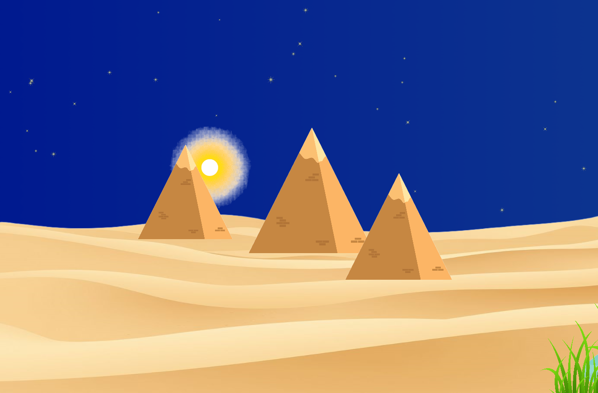
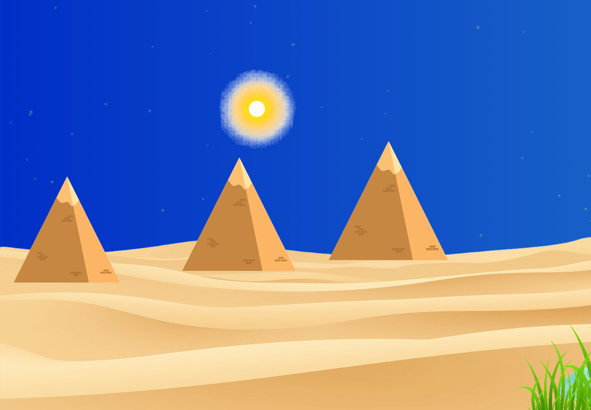

### 1.5 Playing around with fragment shaders 

* Made interesting outcomes

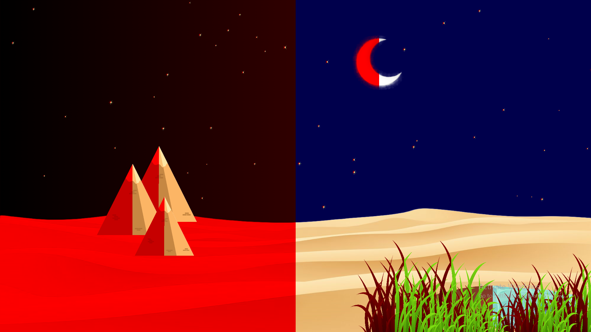

### 1.6 Coloring pyramid 

* With keys `A` and `D`

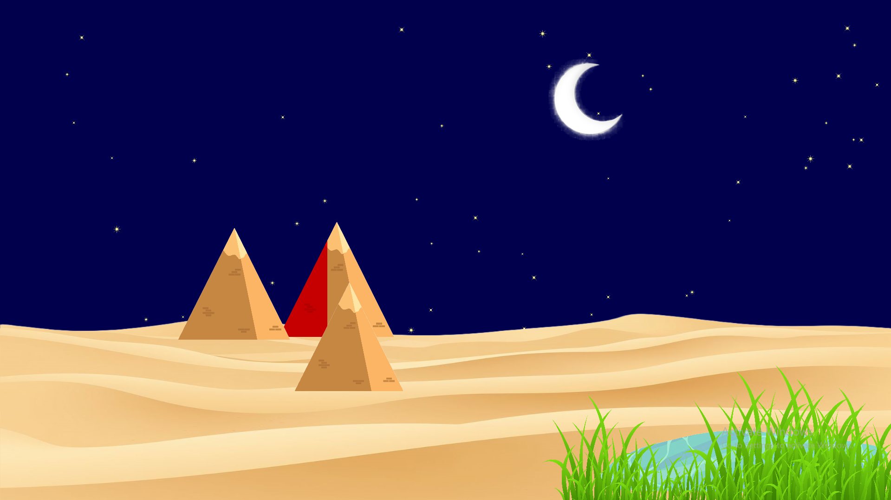

### 1.7 Door appearing and opening

* With key 'O' you make doors appear and start to open.

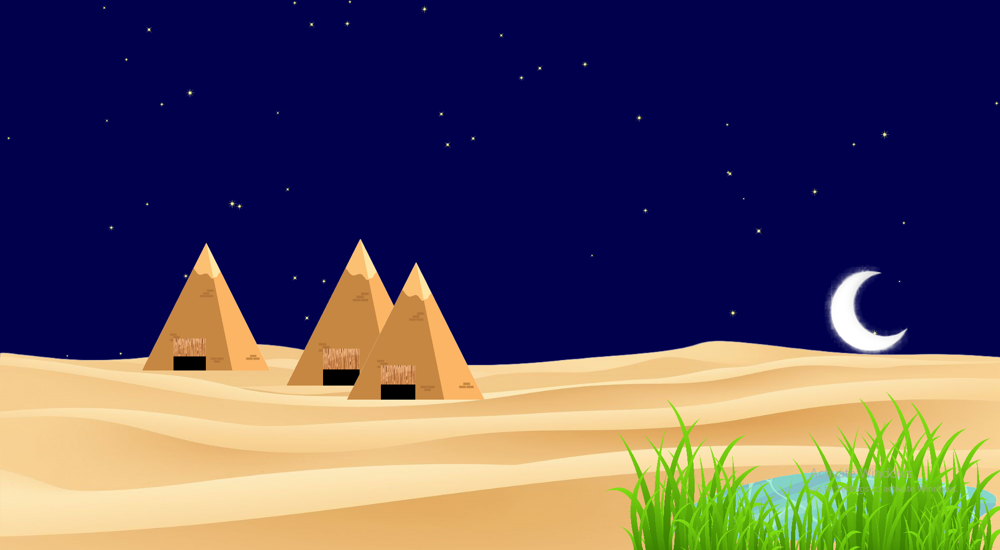](image-12.png)

### 1.8 Displayed text using FreeType

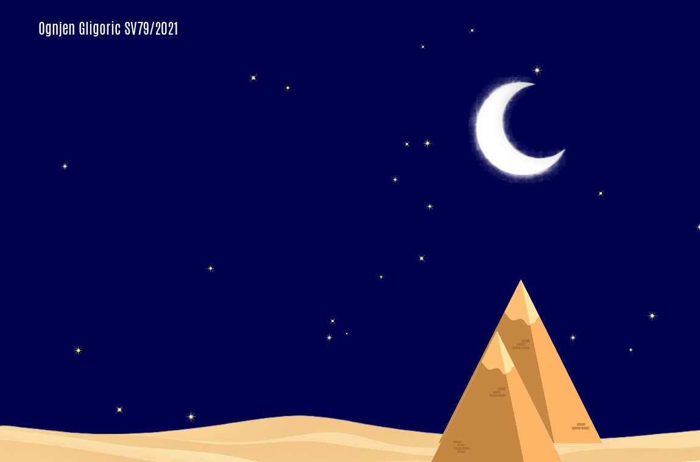